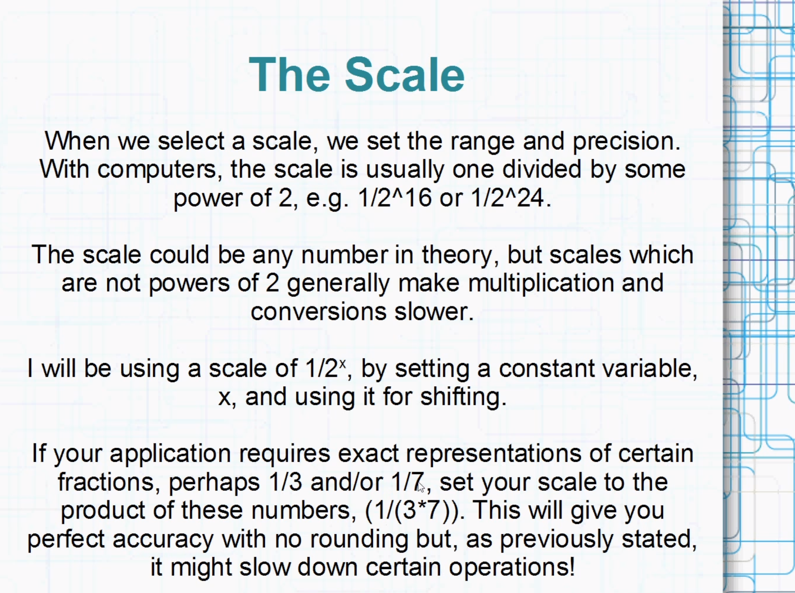

# fxp

 A variable of type float only has about 7 digits of precision, whereas a variable of type double has about 15 digits of precision.

int represents a linear range whereas with float it's a non linear range. 

Floats can represent wide range of numbers but it's not really precise at those different ranges and that can degrade performance depending on situation.

With float you dont have manual control over how precision is controlled (relying on IEE-754 standard)

Problem dealing with fixed point number is need to make sure the result is not overflow.

https://www.youtube.com/watch?v=S12qx1DwjVk
Fixed Point Arithmetic 1: Intro to Fixed Point

